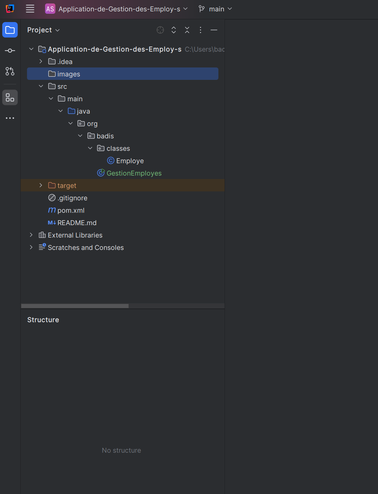
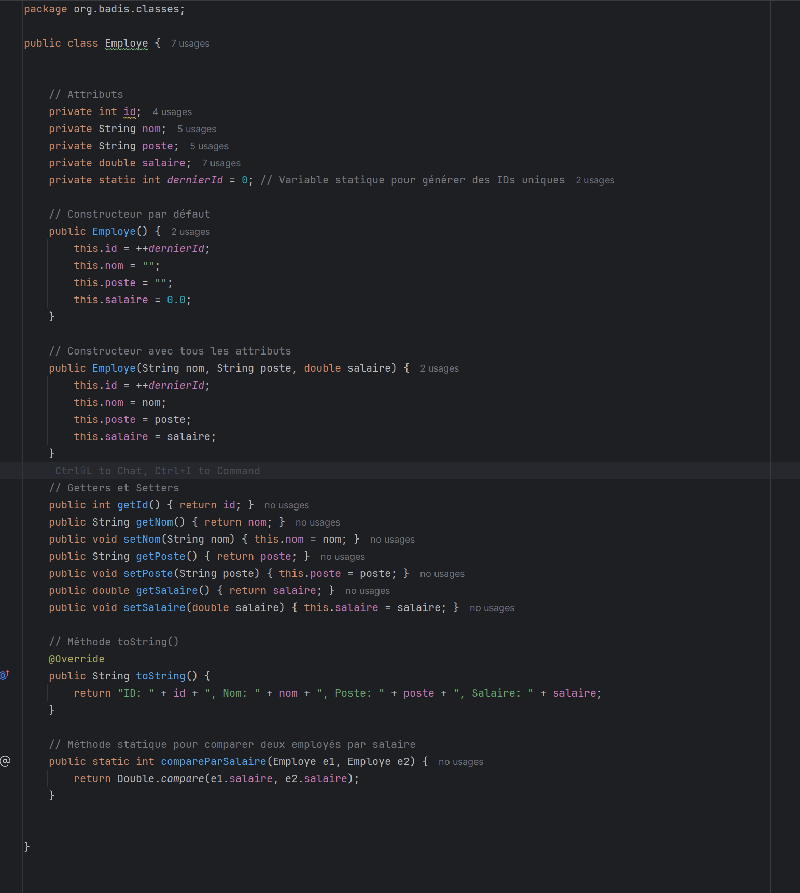
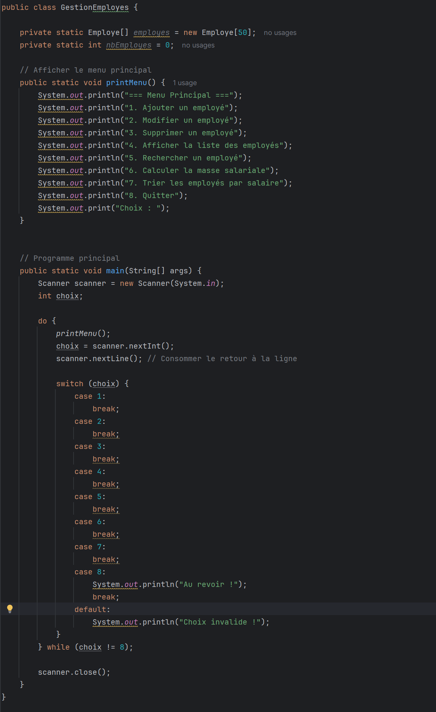
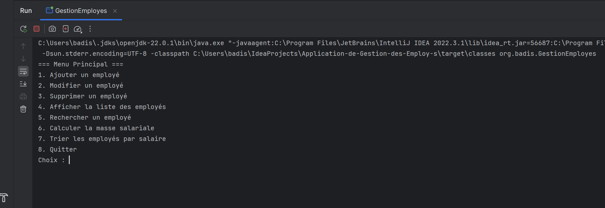

# Application-de-Gestion-des-Employ-s

# 1 - Structure de l'application

# 2 - Classe Employe :

# 3 - Classe Principale GestionEmployes :

## Mèthode PrintMenu() :

## Mèthode AjouterEmploye(Employe employe) :

