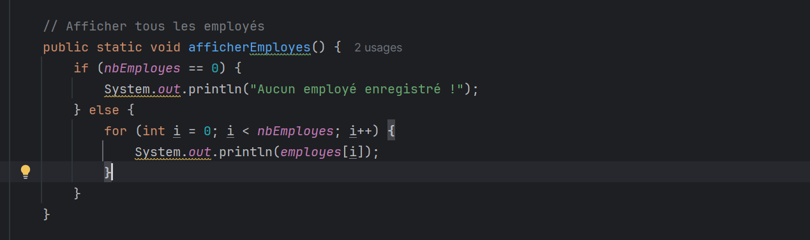

# Application-de-Gestion-des-Employ-s

# 1 - Structure de l'application

# 2 - Classe Employe :

# 3 - Classe Principale GestionEmployes :

## Mèthode PrintMenu() :

## Mèthode AjouterEmploye(Employe employe) :

 

## Mèthode ModifierEmploye(int id, String nouveauNom, String nouveauPoste, double nouveauSalaire) :

## Mèthode SupprimerEmploye(int id)

## Mèthode AfficherEmployes()

## Mèthode RechercherEmploye(String critere)

## Mèthode CalculerMasseSalariale()

## Mèthode TrierEmployesParSalaire(boolean ordreCroissant)

